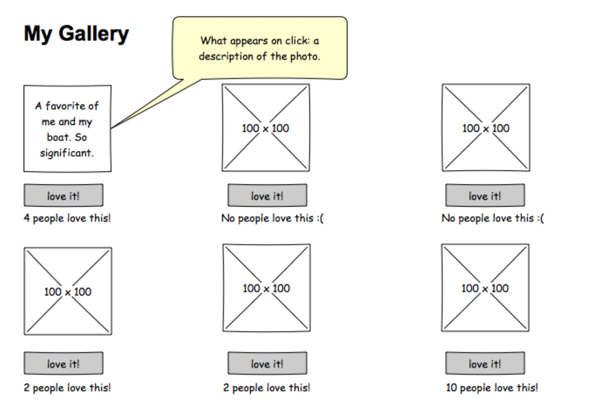

# React - Gallery of My Life

Before you get started make sure to look through the code that has been provided. Server side code to retrieve data (`GET`) and like a photo (`PUT`) have been provided for you. For practice, we recommend testing out these routes in Postman. You should not need to modify these routes for base mode.

### Setup

There is no database component to base mode. All data is stored in an array on the server. Before you get started, add a few images to the `public/images` folder and modify the `server/modules/data.js` to include an `id`, `title`, `description` and `path for` each of your images. Each `id` should be a unique number (e.g. 1, 2, 3...).

Running the server code requires `nodemon`. If you don't already have `nodemon`, install it globally with `npm install nodemon --global`.

```
npm install
npm run server
```

Now that the server is running, open a new terminal tab with `cmd + t` and start the react client app.

```
npm run client
```

Between the server and client, you'll need two terminal tabs! Because we're using `nodemon`, both our client side and server side will automatically spin back up when changes are made!

## BASE MODE

For this project you will create a gallery page to share pictures of things that are important to you. Visitors can click on an image to see a description and use a button to "like" an image. 

To practice passing values through `props` in React, you will build the gallery using mulitple components - an `App`, `GalleryList`, and `GalleryItem`.

- `App` - represents the overall application or site 
- `GalleryList` - represents the gallery of images. By componentizing, we could reuse this component in different applications
- `GalleryItem` - represents a single image in the gallery with the ability to click the image to toggle between image and description as well as the ability to like an image.

### Wireframes

> NOTE: Images don't need to be 100px x 100px but it will be easier if the are all the same dimensions.




### Task List
- Use `axios` to retrieve (`GET`) data from to `/gallery` and store it in `App.jsx`.
- Create a new **component** for the `GalleryList` and pass it the gallery data stored in `App` via `props`.
    - Iterate (loop over) the list of gallery data
    - Make GalleryItems
- Create a new **component** called `GalleryItem.jsx` and pass it the individual gallery item via `props`. 
    - Update the `GalleryList` to use this component to display an image.
    - Swap the image with the description on click. Use [conditional rendering](https://reactjs.org/docs/conditional-rendering.html).
    - Display the number likes for each item and include a like button.
    - When the like button is clicked, use `Axios` to update (`PUT`) the like count `/gallery/like/:id`.
    - Update the gallery each time a like button is clicked.


## STRETCH GOALS

### Use Git Branching

For each `feature` of your application, make a branch, work on the branch, and then merge it into master with `git merge --no-ff`. Feel free to work on the features in any order you like. You should be making branches for whatever feature you are working on.

**Do not start on stretch goals until ALL of base mode is complete. Some of these will require additional research.**

### Features

- Move the data into a database (postgresql)
    - name your database `react_gallery`
    - include a `database.sql` file documenting your database tables
- Add a form (new **component**) that allows a user to POST a new gallery item
  - Client side form (use absolute URL for images)
  - Server side route for posting an image
- Ability to delete a gallery item
- Add styling with Material-UI [https://material-ui.com/](https://material-ui.com/)
- Implement [uppy](https://uppy.io/) for image upload 

> NOTE: The above stretch goals are intended to be completed in order.
